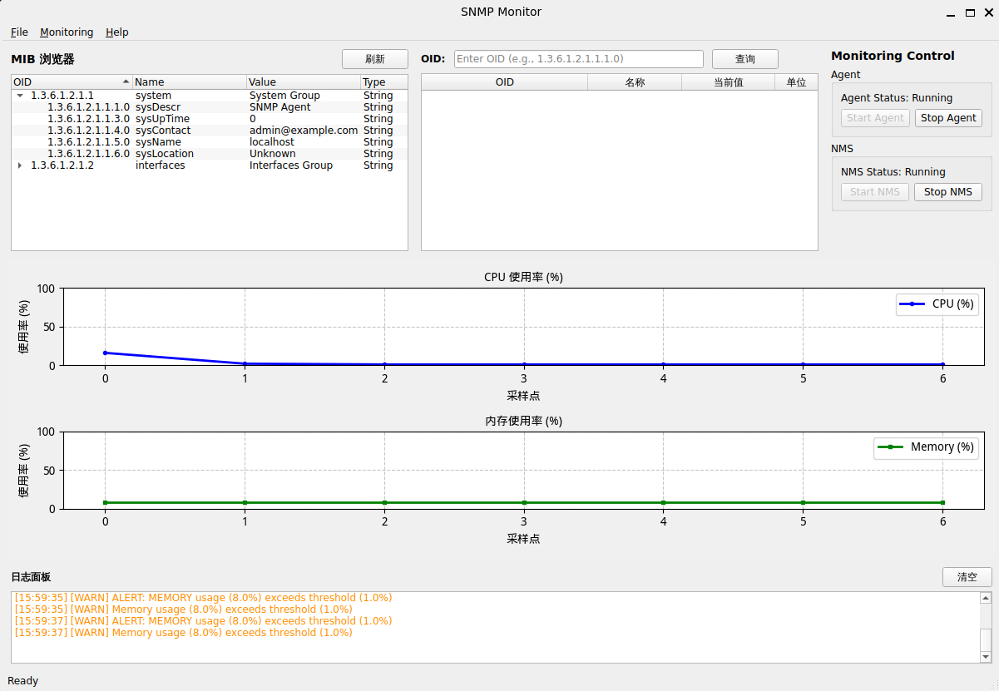
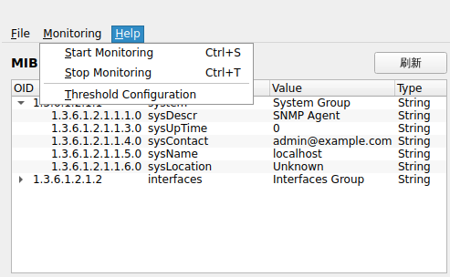
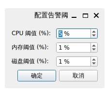

# Simple SNMP Project

这是一个用于学习和演示 SNMP 监控链路的简单项目。项目实现了一个本地 SNMP Agent、一个 NMS 轮询客户端，以及一个 PySide6 图形界面，用来展示主机指标、MIB/OID 查询结果和 Trap 告警日志。

项目目标不是做完整企业级网管系统，而是把 SNMP 的核心通信流程跑通，并用 GUI 直观展示：

- NMS 如何通过 SNMP GET / GETBULK 查询 Agent。
- Agent 如何采集本机 CPU、内存、磁盘等指标。
- Agent 如何在超过阈值时发送 Trap。
- GUI 如何启动/停止 Agent 和 NMS，并展示实时监控数据。

## 功能概览

- **一键启动 GUI**：项目根目录提供 `run.py`，运行后直接进入图形界面。
- **Agent 管理**：GUI 可启动/停止本地 Agent 子进程。
- **NMS 轮询**：GUI 可启动/停止 NMS worker，周期性通过 GETBULK 获取指标。
- **实时曲线**：Dashboard 显示 CPU 和内存利用率曲线。
- **OID 查询**：在右上角 OID 输入框输入 OID 后，可查询并显示 SNMP 返回值。
- **MIB 树选择**：左侧 MIB 树点击节点后，可自动带入 OID 查询。
- **Trap 告警**：Agent 超过阈值后向 GUI TrapWorker 发送告警，底部 Log Panel 实时显示。
- **阈值配置**：菜单中可调整 CPU、内存、磁盘阈值。
- **验收测试**：包含 GETBULK、Agent 启动、Dashboard 曲线、OID 查询和 Trap 流程测试。

## 快速开始

### 1. 创建并激活虚拟环境

```bash
cd /home/leo/workspace/SNMP_project
python3 -m venv .venv
source .venv/bin/activate
```

### 2. 安装依赖

```bash
pip install -r requirements.txt
```

主要依赖包括：

- `pysnmp-lextudio`：SNMP 协议通信。
- `psutil`：采集本机系统指标。
- `PySide6`：GUI 框架。
- `matplotlib`：Dashboard 曲线绘制。
- `pytest` / `pytest-qt`：自动化测试。

### 3. 配置 `config.yaml`

项目根目录的 `config.yaml` 控制 Agent、NMS 和阈值参数：

```yaml
snmp_agent:
  host: "0.0.0.0"
  port: 1161
  community: "public"

nms:
  agent_host: "127.0.0.1"
  agent_port: 1161
  trap_port: 11162

thresholds:
  cpu: 80
  memory: 85
  disk: 90
  check_interval: 10
  cooldown: 300
```

说明：

- `snmp_agent.port` 和 `nms.agent_port` 必须一致。
- 当前项目默认使用 `1161`，避免普通用户启动时需要 root 权限绑定标准 SNMP `161` 端口。
- `trap_port` 默认为 `11162`，由 GUI 的 TrapWorker 监听。
- 如果想快速看到 Trap 告警，可以临时把 `thresholds.cpu`、`thresholds.memory`、`thresholds.disk` 调低。

### 4. 启动项目

推荐从项目根目录运行：

```bash
python run.py
```

也可以使用模块方式启动：

```bash
python -m snmp_monitor.gui
```

如果使用 `run.py`，脚本会先切换到项目根目录，再复用 `snmp_monitor.gui.__main__.main()` 启动 GUI，确保可以正确读取 `config.yaml`。

## 项目功能演示

启动 GUI 后，界面主要分为五个区域：左侧 MIB 树、右上 OID 查询表格、右侧控制面板、中部 Dashboard、底部日志面板。



### 1. Agent 控制

控制面板中包含 Agent 区域：

- **Start Agent**：启动本地 SNMP Agent 子进程。
- **Stop Agent**：停止本地 SNMP Agent。
- **Agent Status**：显示当前 Agent 是否运行。

点击 **Start Agent** 后，GUI 会启动 `python -m snmp_monitor.agent`，并等待 GETBULK readiness 检查通过后再认为 Agent 可用。

### 2. NMS 控制

控制面板中包含 NMS 区域：

- **Start NMS**：启动 SNMP 轮询 worker 和 Trap 监听 worker。
- **Stop NMS**：停止 SNMP 轮询和 Trap 监听。
- **NMS Status**：显示当前 NMS 是否运行。

正常使用顺序建议为：

1. 点击 **Start Agent**。
2. 等待 Agent 状态变为 running。
3. 点击 **Start NMS**。
4. 观察 Dashboard 曲线和底部日志。

### 3. Dashboard 曲线

中部 Dashboard 展示：

- CPU 使用率曲线。
- 内存使用率曲线。

NMS worker 会定期对 Agent 发起 GETBULK 请求，将返回的 OID 值转换为指标数据，再通过 `SNMPModel` 驱动 Dashboard 更新。



### 4. MIB 树与 OID 查询

左侧 MIB 树用于浏览常见 OID。点击某个 OID 后：

1. OID 会填入右上角查询输入框。
2. GUI 会发起单个 OID 查询。
3. 查询结果会显示在右上角表格中。
4. 底部日志也会记录查询过程和结果。

也可以手动输入 OID，例如：

```text
1.3.6.1.2.1.1.1.0
```

点击 **查询** 后，GUI 会通过 SNMP GET 查询该 OID。

### 5. Log Panel

底部日志面板用于观察运行状态：

- Agent / NMS 启动停止日志。
- GETBULK 轮询日志。
- OID 查询结果。
- Trap 告警消息。
- 错误和异常信息。

当 Agent 指标超过阈值时，Trap 会通过 UDP `11162` 发到 GUI，日志面板会显示收到的 Trap。

### 6. 菜单功能

顶部菜单包含：

- **File → Exit**：退出应用。
- **Monitoring → Start Monitoring**：启动监控。
- **Monitoring → Stop Monitoring**：停止监控。
- **Monitoring → Threshold Configuration**：打开阈值配置窗口。
- **Help → About**：查看项目信息。

阈值配置窗口可以调整 CPU、内存、磁盘阈值，便于演示 Trap 告警触发。



## 整体架构

项目采用三层结构：Agent、NMS、GUI。

```text
┌──────────────────────────────────────────────────────────────────┐
│                              GUI                                  │
│                                                                  │
│  ┌──────────────┐   ┌───────────────┐   ┌────────────────────┐   │
│  │ ControlPanel │   │ Dashboard     │   │ OID Table / MIB    │   │
│  └──────┬───────┘   └───────▲───────┘   └─────────▲──────────┘   │
│         │                   │                     │              │
│  ┌──────▼───────┐   ┌───────┴───────┐   ┌─────────┴──────────┐   │
│  │ AgentWorker  │   │ SNMPWorker    │   │ TrapWorker         │   │
│  └──────┬───────┘   └───────┬───────┘   └─────────▲──────────┘   │
└─────────│───────────────────│─────────────────────│──────────────┘
          │ start subprocess  │ SNMP GET/GETBULK    │ UDP Trap
          ▼                   ▼                     │
┌──────────────────┐    ┌──────────────────┐        │
│      Agent       │◄───│       NMS        │        │
│                  │    │                  │        │
│ SNMP responders  │    │ SNMPClient       │        │
│ DataCollector    │    │ polling wrapper  │        │
│ ThresholdMonitor │────┴──────────────────┴────────┘
└──────────────────┘
```

### 数据流

- **指标轮询流**：`GUI SNMPWorker → NMS SNMPClient → Agent GETBULK responder → SNMPModel → Dashboard`
- **单 OID 查询流**：`DataTableWidget → SNMPWorker.query_oid() → SNMPClient.get() → DataTableWidget`
- **Trap 告警流**：`Agent ThresholdMonitor → TrapSender → UDP 11162 → GUI TrapWorker → LogPanel`
- **进程控制流**：`GUI ControlPanel → AgentWorker → python -m snmp_monitor.agent`

## 架构分层哲学

### 1. Agent 只关心“被管理设备”

Agent 层负责暴露 SNMP 能力和采集本机指标。它不关心 GUI 如何展示，也不直接依赖 NMS 的界面逻辑。

### 2. NMS 只关心“协议访问”

NMS 层封装 SNMP GET、GETNEXT、GETBULK 等协议操作。GUI 不直接操作 pysnmp，而是通过 NMS client 获取 Python 数据结构。

### 3. GUI 只关心“交互与展示”

GUI 层负责用户交互、线程编排和视图更新。它通过 worker 访问 Agent/NMS，避免阻塞主线程。

### 4. Trap 不再绕过多余层级

项目采用 `Agent → GUI TrapWorker` 的直接 Trap 架构，避免 NMS 和 GUI 争抢同一个 Trap 端口。NMS 专注轮询，GUI 专注接收告警和展示。

### 5. 用测试固化真实链路

项目中的验收测试优先模拟真实端到端路径，而不是只测孤立函数。例如：

- Agent 启动后 GETBULK 是否真的 ready。
- 真实 SNMP 字符串值是否能驱动 Dashboard 曲线。
- OID 查询结果是否真正显示在 GUI 表格中。

## Agent 层代码设计

Agent 代码位于 `snmp_monitor/agent/`。

### 主要文件

- `snmp_monitor/agent/__main__.py`：Agent 命令行入口，支持 `python -m snmp_monitor.agent`。
- `snmp_monitor/agent/server.py`：SNMP Agent Server 和 GET/GETNEXT/GETBULK responder。
- `snmp_monitor/agent/handlers.py`：系统指标采集 handler。
- `snmp_monitor/agent/trap.py`：TrapSender 和 ThresholdMonitor。

### 设计要点

- `SNMPAgentServer` 负责初始化 pysnmp engine、UDP transport、community 和 command responder。
- `SNMPGetHandler` 响应单个 SNMP GET 请求。
- `SNMPGetNextHandler` 支持 OID 顺序遍历。
- `SNMPGetBulkHandler` 支持 GUI 高频使用的 GETBULK 批量查询。
- `_supported_oids()` 集中定义 Agent 支持的 OID 集合。
- `_build_oid_value()` 将 OID 映射到系统指标或模拟值。
- `ThresholdMonitor` 周期性采集 CPU、内存、磁盘并判断阈值。
- `TrapSender` 在阈值超限时向 GUI TrapWorker 发送 UDP Trap。

### Agent 生命周期

```text
启动 Agent
  -> 读取 config.yaml
  -> 绑定 UDP 1161
  -> 注册 GET / GETNEXT / GETBULK responder
  -> 启动 ThresholdMonitor
  -> 等待 NMS 查询或阈值告警
```

## NMS 层代码设计

NMS 代码位于 `snmp_monitor/nms/`。

### 主要文件

- `snmp_monitor/nms/client.py`：SNMPClient，封装 pysnmp 异步 API。
- `snmp_monitor/nms/engine.py`：轮询引擎封装。
- `snmp_monitor/nms/oids.py`：常用 OID 和 SNMP 版本常量。

### 设计要点

- `SNMPClient.get()` 执行单个 OID 查询，用于 GUI OID 查询框。
- `SNMPClient.get_next()` 执行 GETNEXT。
- `SNMPClient.get_bulk()` 执行 GETBULK，是 Dashboard 实时指标的主要数据来源。
- 每次请求使用独立 `SnmpEngine()`，请求结束后关闭 dispatcher，避免长期 GUI 运行中事件循环状态污染。
- GETBULK 返回 `List[(OID tuple, value str)]`，GUI worker 再转换为 dict。
- NMS 不处理 Trap，避免和 GUI TrapWorker 竞争端口。

### NMS 轮询流程

```text
SNMPWorker._poll()
  -> SNMPClient.get_bulk(base_oid)
  -> [(oid_tuple, value), ...]
  -> {oid_tuple: value}
  -> MainWindow._on_worker_data_ready()
  -> SNMPModel.update_data()
  -> DashboardWidget.update_data()
```

## GUI 层代码设计

GUI 代码位于 `snmp_monitor/gui/`。

### 主要文件

- `snmp_monitor/gui/__main__.py`：GUI 模块入口。
- `snmp_monitor/gui/app.py`：MainWindow，负责组装视图、模型和 worker。
- `snmp_monitor/gui/models/`：SNMPModel、MIBModel、TrapModel。
- `snmp_monitor/gui/views/`：Dashboard、DataTable、DeviceTree、LogPanel、AlertDialog。
- `snmp_monitor/gui/workers/`：AgentWorker、SNMPWorker、TrapWorker。

### 设计要点

- GUI 使用 PySide6，耗时操作放在 worker 中，避免阻塞主线程。
- `AgentWorker` 使用 subprocess 启动 Agent，并等待 GETBULK ready 后再通知 GUI。
- `SNMPWorker` 周期性轮询 Agent，也负责单 OID 查询。
- `TrapWorker` 监听 UDP Trap，并把 Trap 数据通过 Qt signal 发送给主线程。
- `SNMPModel` 是 Dashboard 的统一数据入口，避免视图被多个路径重复更新。
- `DashboardWidget` 使用 matplotlib 绘制 CPU / 内存曲线，并设置最小高度避免被 Qt layout 压扁。
- `DataTableWidget` 支持 OID 查询结果新增行，保证 log 有结果时表格也能显示结果。

### GUI 更新流程

```text
Worker thread emits signal
  -> MainWindow slot receives data
  -> Model normalizes data
  -> View consumes model data
  -> GUI main thread redraws widgets
```

## 项目三个亮点

1. **完整跑通 SNMP 核心链路**：包含 GET、GETNEXT、GETBULK、Trap 和 GUI 展示，不只是静态界面或 mock demo。
2. **真实 GUI 可用性修复充分**：针对 GETBULK timeout、Dashboard 无曲线、图表压缩、OID 查询不显示等真实问题都建立了验收测试。
3. **架构边界清晰**：Agent、NMS、GUI 分层明确，Trap 直达 GUI，NMS 专注轮询，后续扩展更容易定位修改点。

## 项目三个难点

1. **pysnmp API 与事件循环细节**：GETBULK responder、asyncio hlapi、dispatcher 生命周期都容易导致“代码没报错但收不到包”。
2. **GUI 线程与信号传递**：真实 SNMP 数据包含 tuple-key dict，Qt signal 类型选择不当会导致跨线程传递失败。
3. **真实端到端问题难靠旧测试发现**：旧测试使用理想 float 数据或只测方法存在，无法发现真实 GUI 中曲线不显示、表格不更新、布局被压扁等集成问题。

## 常用测试命令

```bash
cd /home/leo/workspace/SNMP_project
source .venv/bin/activate
QT_QPA_PLATFORM=offscreen PYTHONPATH=/home/leo/workspace/SNMP_project pytest -q
```

如果只想跑关键验收测试：

```bash
QT_QPA_PLATFORM=offscreen PYTHONPATH=/home/leo/workspace/SNMP_project pytest -q tests/test_acceptance
```
